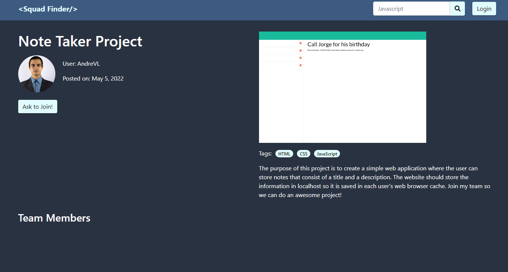

# Squad Finder

## Description

- What was your motivation?  
  This began since we recently graduated and wanted a platform/application where anyone could showcase their new ideas, or join other people in their journey to become more experienced.

- Why did you build this project?  
  To let anyone have the ability to build a team and work on a specific idea.

- What problem does it solve?  
  Avoid certain time restrictions, here you can join people with similar abilities and time of study as you

- What did you learn?  
  How to implement and deploy a full MERN application.
   
- Briefly describe your Project:  
  Squad Finder has a homepage with projects displayed, a modal to create an account and the ability to create a project once signed in. To be able to join teams and create your own, as well as accept them or decline them.
   

## Table of Contents

- [Images](#images)
- [Description](#description)
- [Installation](#installation)
- [Usage](#usage)
- [License](#license)
- [Contributors](#Contributors)
- [Questions](#questions)

## Images

## Installation

What are the steps required to install your project?

    This is deployed to heroku, but you can git clone this repo.

## Usage

Provide instructions for use:

    Once cloned, run "npm i && npm run develop"

## Contributors

Isaac Galvan, Abimael Monarrez, André Vega, Enoc Rojas.

## Questions

Check out our work!
Find us on GitHub: 
 (https://github.com/isaacgalvan10)  
Email: 📧 rojiyoyo@gmail.com

 (https://github.com/Abimael1996)  
Email: 📧 rojiyoyo@gmail.com

 (https://github.com/AndreV96)  
Email: 📧 rojiyoyo@gmail.com

 (https://github.com/Enrique-Rojas-Villegas)  
Email: 📧 rojiyoyo@gmail.com
